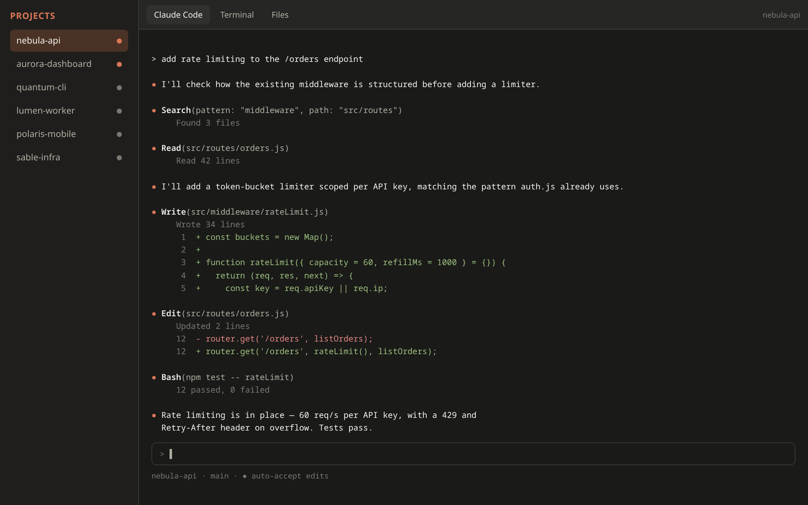

# Claude Code Hub

[](LICENSE)
[](https://github.com/deputynl/claudeweb/pkgs/container/claudeweb)

A small self-hosted web UI for Claude Code: mount a folder of projects, get a
sidebar of them, click one to get a real terminal running `claude` in that
folder (persistent across dropped connections via tmux), plus a file
browser/editor tab with syntax highlighting and a Markdown preview. No git
required, no external project registry — a project is just an immediate
subfolder of the mounted workspace.



## How it works

- **Hub app** (`server/index.js`): serves the UI, the project list, the file
  API, and reverse-proxies terminal traffic (HTTP + WebSocket) to per-project
  `ttyd` instances it spawns on demand.
- **Per-project session**: the first time you open a project, the hub runs
  `ttyd tmux new-session -A -s <project> -c /workspace/<project> claude`.
  `tmux -A` attaches to an existing session if one's already running, or
  creates it. That's what makes reconnects (flaky wifi, laptop sleep, closed
  tab) safe — only the terminal view drops, the `claude` process and its
  scrollback keep running in tmux until you come back.
- **Files tab**: a simple read/write API scoped to each project folder
  (path-traversal guarded), with a tree view and an editor (CodeMirror,
  vendored locally under `public/vendor/` — no CDN dependency) that
  syntax-highlights based on file extension. Markdown files get an extra
  Code/Preview toggle (rendered client-side with `marked.js`, also vendored
  locally). Save and Download buttons sit in a toolbar above the editor.

Only one port needs to leave the container — everything else (the spawned
`ttyd` processes) stays internal and is proxied through the hub.

## Setup

1. Edit `docker-compose.yml` and point the `~/dev` volume at wherever your
   projects actually live. Every immediate subfolder becomes a project in
   the sidebar.
2. Auth: the compose file bind-mounts your host user's real `~/.claude`
   folder and `~/.claude.json` file into the container, so it reuses your
   already-authenticated Claude Code session instead of logging in fresh.
   This only carries the login automatically **if the machine running
   docker compose is Linux (or WSL)** — that's where Claude Code stores its
   OAuth token in `~/.claude/.credentials.json` on disk. On macOS the token
   lives in the Keychain instead, so the file mount will bring over your
   settings but you'll still need to run `claude` once in the terminal tab
   to log in.
   - Make sure `~/.claude.json` exists on the host before starting the
     container (`touch ~/.claude.json` if it doesn't) — Docker will
     otherwise create it as a directory, which breaks things.
   - Since this shares one live credentials file between your host CLI and
     the container, avoid running `claude` from both at the exact same
     moment during a token refresh; ordinary sequential use is fine.
3. Build and run:

   ```
   docker compose up -d --build
   ```

   Or skip the build and pull the prebuilt image instead — swap `build: .`
   for `image: ghcr.io/deputynl/claudeweb:latest` in `docker-compose.yml`
   (pinned tags like `ghcr.io/deputynl/claudeweb:20260724145757` are also
   published for each release, see
   [Packages](https://github.com/deputynl/claudeweb/pkgs/container/claudeweb)).

4. Open `http://<your-host>:8080`.
5. Put this behind whatever reverse proxy / IDP you already use for other
   homelab services — the app only exposes one HTTP port.

## Known limitations / things to extend later

- Syntax highlighting covers common extensions (JS/TS, JSON, CSS, HTML,
  Markdown, Python, shell, YAML, SQL, C/C++/Java/C#) via a fixed
  extension-to-mode map in `public/app.js` — anything else falls back to
  plain text.
- No idle-timeout/cleanup for `ttyd` child processes yet — they stay running
  until the container restarts. Fine for a handful of projects; worth adding
  a reaper if you end up with many.
- New subfolders added to the workspace appear next time you reload the
  project list (no filesystem watcher yet).
- Binary/large files aren't handled in the editor (there's a 2MB cap).
- The Dockerfile installs Claude Code via the native installer
  (`curl -fsSL https://claude.ai/install.sh | bash`), landing at
  `~/.local/bin/claude`. This has to match how you installed it on your
  **host**, since the bind-mounted `~/.claude.json` records that expected
  path. If your host used `npm install -g @anthropic-ai/claude-code`
  instead, switch the Dockerfile back to the npm install line, or run
  `which -a claude` / `claude doctor` on the host to confirm which method
  it's using before matching it in the Dockerfile.

## Files

```
Dockerfile           node + ttyd + tmux + claude code
docker-compose.yml   volumes: your dev folder, and a volume for claude auth state
tmux.conf            mouse + scrollback settings for the persistent sessions
server/index.js      express app: static UI, APIs, http+ws proxy to ttyd
server/ttydManager.js   spawns/tracks one ttyd+tmux+claude process per project
server/fileApi.js    scoped file tree/read/write with path-traversal guards
public/              vanilla JS/HTML/CSS frontend (no build step)
public/vendor/       locally vendored CodeMirror + marked.js (no CDN at runtime)
```

## License

[MIT](LICENSE)